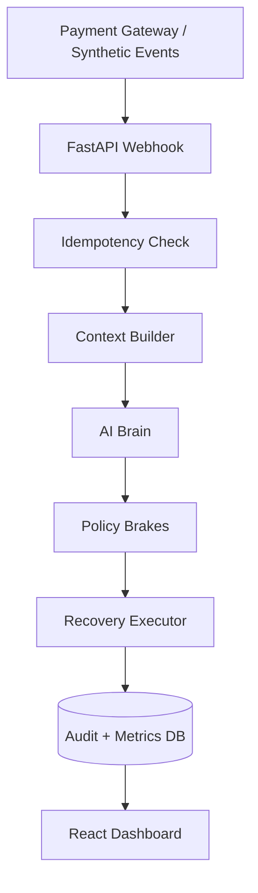

# RecoverAI

RecoverAI is an AI-powered revenue recovery agent that intelligently, yet safely, recovers revenue from failed payments.

## 🚨 Test Mode & Hackathon Scope

**This is a hackathon prototype.**

RecoverAI integrates with **Razorpay Test Mode** for its demonstrated payment flow. It also supports synthetic/local webhook events for deterministic, fully offline demonstrations. In either case:

- **No live/production Razorpay payments are processed.**
- **No real money is moved.**
- The ₹199 payment-success demonstration is a Test Mode / simulated confirmation — it is not a real financial charge.

Do not mistake "no real money moved" for "no Razorpay integration" — the webhook pipeline, signature verification, and payment normalisation all run against Razorpay's Test Mode infrastructure. This project is not intended for production use.

## The Problem

Failed payments are a massive source of revenue leakage for digital businesses. However, attempting to recover them is fraught with risk:
- Blindly retrying payments can lead to high network costs, flagged merchant accounts, and a poor customer experience.
- Businesses need recovery actions that adapt to the context of the failure (e.g., insufficient funds vs. suspected fraud vs. network timeout).
- Pure AI or LLM-based recovery systems lack hard stopping rules, deterministic guardrails, and the strict auditability required in financial operations.

## Our Solution

RecoverAI introduces a dual-layer architecture separating intelligence from authority. 

The recovery flow:
**Payment Failure** → **Context Builder** → **AI Brain** → **Policy Brakes** → **Recovery Executor** → **Outcome** → **Audit Trail** → **Dashboard**

The core philosophy of RecoverAI is: **"AI recommends. Policy decides."**

The **AI Brain** analyzes the failure context and proposes an action. However, the deterministic **Policy Brakes** sit between the AI and the Executor, holding the final authority to approve, block, or escalate the action based on strict business rules.

## Key Features

- **AI-Powered Recovery Recommendations:** Context-aware suggestions based on failure reasons and customer data.
- **Deterministic Policy Guardrails:** Hard-coded safety rules that override AI recommendations if they violate business constraints.
- **Retry-Limit Protection:** Prevents infinite retry loops on chronically failing cards.
- **Opted-Out Customer Protection:** Respects customer communication and retry preferences.
- **Recovery-Window Protection:** Ensures recovery attempts only happen within a valid time frame.
- **Webhook Idempotency:** Safely handles duplicate webhook deliveries.
- **Simulated Recovery Execution:** Mock execution layer demonstrating the full pipeline outcome.
- **Revenue Recovery Metrics:** Tracks Revenue at Risk, Revenue Recovered, and Recovery Rates (in integer paise).
- **Intervention Audit Trail:** Detailed logging of every step taken during a recovery attempt.
- **Decision Trace Visualization:** A clear UI showing exactly why an action was taken or blocked.
- **Dashboard:** Real-time KPIs, action distribution charts, and filterable event tables.

## Architecture



*Note: The AI Brain never directly executes an action. All execution goes through the Policy Brakes.*

## AI Brain vs Policy Brakes

**"AI can recommend. Policy can override."**

| AI Brain | Policy Brakes |
| :--- | :--- |
| Probabilistic recommendation | Deterministic rules |
| Failure classification | Retry limits |
| Confidence scoring | Customer opt-out lists |
| Contextual reasoning | Recovery window boundaries |
| **No execution authority** | Transaction state validation |
| | Minimum confidence threshold |
| | **Final action authority** |

## Recovery Actions

RecoverAI supports the following simulated actions:

- `DO_NOTHING`: The payment is abandoned (e.g., due to fraud or hard decline).
- `SILENT_RETRY`: The payment is retried automatically in the background without user friction.
- `SEND_PAYMENT_LINK`: The customer is sent an alternative method to complete the payment.
- `ESCALATE`: The case is flagged for human review due to ambiguity or policy violation.

*Note: Execution of these actions is strictly simulated for demonstration purposes.*

## Dashboard

The React-based dashboard provides a complete view of the recovery operations:

- **Revenue at Risk:** Total value of transactions that entered the recovery pipeline.
- **Revenue Recovered:** Total value successfully saved.
- **Recovery Rate:** Percentage of at-risk revenue successfully recovered.
- **Escalated Cases:** Number of interventions requiring human review.
- **Intervention Count:** Total number of recovery attempts processed.
- **Action Distribution:** Chart showing the breakdown of final actions taken (`SILENT_RETRY`, `ESCALATE`, etc.).
- **Recovery Performance:** Visual comparison of at-risk vs. recovered revenue.
- **Intervention Table:** Searchable, filterable, and paginated list of all recovery events.
- **Decision Trace Modal:** Click any event to see the step-by-step trace from AI recommendation to Policy approval/rejection to final simulated execution.

## Tech Stack

**Backend:**
- Python
- FastAPI
- SQLAlchemy (with SQLite)
- Pydantic
- Groq (LLM Integration)

**Frontend:**
- React
- TypeScript
- Vite
- Tailwind CSS
- Recharts
- Axios
- React Query
- Lucide React

## Project Structure

```text
recoverai/
├── .env                    # Root environment variables
├── backend/
│   ├── app/
│   │   ├── main.py         # FastAPI application entrypoint
│   │   ├── api_routes.py   # Read-only dashboard endpoints
│   │   ├── database.py     # SQLite connection setup
│   │   ├── models.py       # SQLAlchemy ORM models
│   │   ├── webhook_handler.py # Synthetic webhook processing
│   │   └── ...             # Core pipeline (brain, policy, executor)
│   ├── tests/              # Pytest suite
│   └── requirements.txt    # Python dependencies
└── frontend/
    ├── src/
    │   ├── api/            # Axios client and React Query hooks
    │   ├── components/     # React components (KPIs, Charts, Table, Trace Modal)
    │   ├── pages/          # Dashboard page
    │   ├── App.tsx         # Main React entrypoint
    │   └── main.tsx        # Vite mounting and QueryProvider
    ├── package.json        # NPM dependencies
    └── vite.config.ts      # Vite configuration with backend proxy
```

## Getting Started

Follow these instructions to run the project locally on Windows using PowerShell.

### Backend Setup

1. Ensure you are in the repository root:
   ```powershell
   cd recoverai
   ```
2. Create and activate a Python virtual environment:
   ```powershell
   python -m venv .venv
   .\.venv\Scripts\activate
   ```
3. Install the required dependencies:
   ```powershell
   pip install -r backend\requirements.txt
   ```
4. Create a `.env` file in the **repository root** (`recoverai/.env`) and configure your Groq API key:
   ```env
   GROQ_API_KEY=your_actual_api_key_here
   ```
   *(Do NOT commit your `.env` file to version control)*
5. Start the FastAPI server from the repository root:
   ```powershell
   .\.venv\Scripts\uvicorn.exe backend.app.main:app --port 8000 --reload
   ```

### Frontend Setup

1. Open a new PowerShell terminal and navigate to the frontend directory:
   ```powershell
   cd frontend
   ```
2. Install the Node dependencies:
   ```powershell
   npm install
   ```
3. Start the Vite development server:
   ```powershell
   npm.cmd run dev
   ```

## Database & Demo Data Setup

A fresh clone has no database. The two scripts below initialize it. **Run them once, in order, after activating your virtual environment.**

### Step 1 — Generate the synthetic dataset (one-time initialization)

`backend/scripts/generate_data.py` creates the full synthetic dataset: ~250 customers and exactly 1,000 transactions with realistic INR amounts and failure scenarios.

```powershell
python backend/scripts/generate_data.py
```

> ⚠️ **This script resets the synthetic tables on every run.** Treat it as a **one-time initialization step** for a fresh environment. Do not rerun it against a database that already has live webhook data — it will wipe the existing records.

### Step 2 — Provision the demo transaction (idempotent)

`backend/scripts/create_demo_transaction.py` adds the specific `txn_demo_001` / `cust_demo_001` and `txn_demo_002` / `cust_demo_002` records needed for the Razorpay Test Mode ₹199 demo flow.

```powershell
python backend/scripts/create_demo_transaction.py
```

This script is **idempotent** — it is safe to run multiple times and will not create duplicates. It does **not** delete any existing data.

---

## API Endpoints

The FastAPI backend exposes the following endpoints:

- `GET /health` : Health check for the API.

- `POST /webhooks/payment` : Ingestion point for synthetic payment failure webhooks.
- `GET /api/metrics` : Aggregated KPIs (Revenue at risk, recovered, etc.).
- `GET /api/interventions` : Paginated and filterable list of all recovery interventions.
- `GET /api/interventions/{txn_id}` : Full decision trace for a specific transaction.
- `GET /api/action-distribution` : Data for the action distribution donut chart.

## Webhook Example

RecoverAI's webhook pipeline handles two event sources through the same processing path:

- **Razorpay Test Mode:** `payment.failed` events from Razorpay's Test Mode are received, signature-verified, normalised, and fed into the recovery pipeline.
- **Synthetic / local events:** You can inject a deterministic test event directly via `POST /webhooks/payment` without any Razorpay credentials. This is useful for offline demos, CI, and judge walkthroughs.

The synthetic payload format is:

```json
{
  "event_id": "evt_synth_demo_001",
  "event_type": "payment.failed",
  "txn_id": "txn_demo_001",
  "synthetic": true
}
```

> *Note: `txn_demo_001` must correspond to an existing transaction in your database. Run `create_demo_transaction.py` (see [Database & Demo Data Setup](#database--demo-data-setup)) before sending this payload.*

## Safety & Reliability

- **Webhook Idempotency:** The system gracefully ignores duplicate `event_id` deliveries to prevent double-processing.
- **Deterministic Policy Enforcement:** Business rules always win. An LLM hallucination cannot force an unauthorized action.
- **No Real Payment Execution:** The "Recovery Executor" operates strictly in test mode, writing outcomes to the local database without making external financial API calls.
- **Integer Paise Representation:** All financial math uses integer paise to completely eliminate floating-point precision errors.
- **Audit Logging:** Every stage (Recommendation → Policy → Execution) is written to the database for full traceability.
- **Safe Fallback:** If the AI Brain fails to respond or returns invalid data, the system fails closed (defaults to `ESCALATE` or `DO_NOTHING`).

## Testing

To run the automated test suite from the repository root, run:

```powershell
.\.venv\Scripts\python.exe -m pytest
```

## Demo Flow

For judges reviewing the project, we suggest the following flow:

1. **Open the Dashboard:** Navigate to `http://localhost:5173`.
2. **Review Metrics:** Show the live API status, KPIs, and charts.
3. **Inspect a Successful Recovery:** Click a successfully recovered event in the table. Show the Decision Trace modal where the AI recommendation matches the Policy approval and flows to the Executor.
4. **Inspect an Escalation:** Find an `ESCALATE` event in the table. Open the trace and show how the Policy Brakes actively overrode a risky AI recommendation.
5. **Trigger a Webhook:** Send a synthetic or Razorpay Test Mode webhook and watch the dashboard update live.
6. **Show Idempotency:** Resend the exact same webhook and demonstrate that duplicate processing is prevented.

### The Recovery Pipeline (Step by Step)

```
FAILED payment
  → Razorpay Test Mode webhook  ─┐
  → Synthetic/local webhook      ┘  (either path enters the same pipeline)
  → Idempotency Check
  → Context Builder
  → AI Brain  (recommends an action)
  → Policy Brakes  (authorize / block / override)
  → Recovery Executor  (records the intervention)
  → Outcome
```

> **"An executed recovery action is not the same as recovered revenue."**

- For `SEND_PAYMENT_LINK` and `SILENT_RETRY` actions, the transaction does **not** immediately count as recovered.
- Payment success must actually be confirmed (via Test Mode or a simulated success callback).
- **Only then** is `recovered_amount` recorded and `revenue_at_risk` reduced on the dashboard.

### The ₹199 Demo

The ₹199 recovery shown in the dashboard reflects a **Test Mode / simulated payment-success confirmation** — not an AI decision alone. The AI recommended the recovery action; the Policy Brakes authorised it; the Executor dispatched it; and only after the payment-success event was received did the ₹199 count as recovered revenue. The AI did not itself recover the ₹199.

## What Makes RecoverAI Different?

**Knowing when NOT to act.**

Many AI agents blindly map LLM outputs directly to execution layers. RecoverAI acknowledges that LLMs are probabilistic and sometimes wrong. By placing a rigid, deterministic **Policy Brake** between the AI Brain and the Execution layer, RecoverAI guarantees that business logic, customer safety, and compliance are never compromised by an eager AI.

---

### Disclaimer

*This project was built as a prototype for a hackathon. It utilizes synthetic test data and simulated recovery endpoints. No real financial transactions are executed, processed, or stored.*
